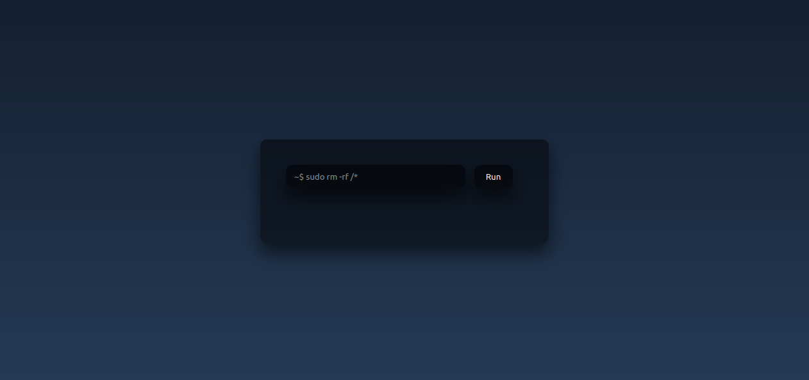
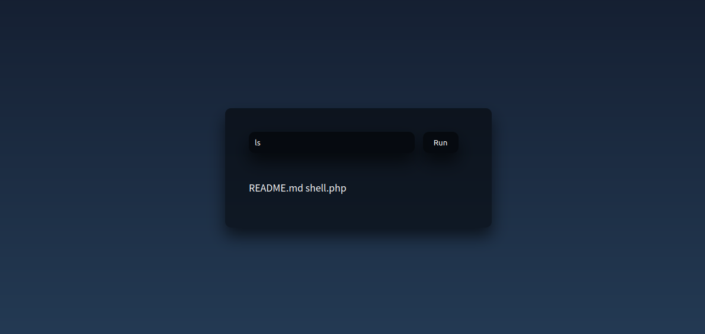

# Simple-WebShell
This is a simple webshell<br>
You can run system commands on it<br>
hope you like it <3


# Test
How to test it?<br>
Go to the shell folder and run php localhost:
```
cd Simple-WebShell
php -S localhost:6060
```
then open the following url<br>
```
http://localhost:6060/shell.php
```
u can use curl too:<br>
```
curl http://localhost:6060/shell.php?q=[YOUR-COMMAND]
```


# Developer
coded by FireKing255<br>
instagram: https://instagram.com/fireking255.hack<br>
github: https://github.com/fireking255<br>
website: https://fireking255.github.io/


# Demo


